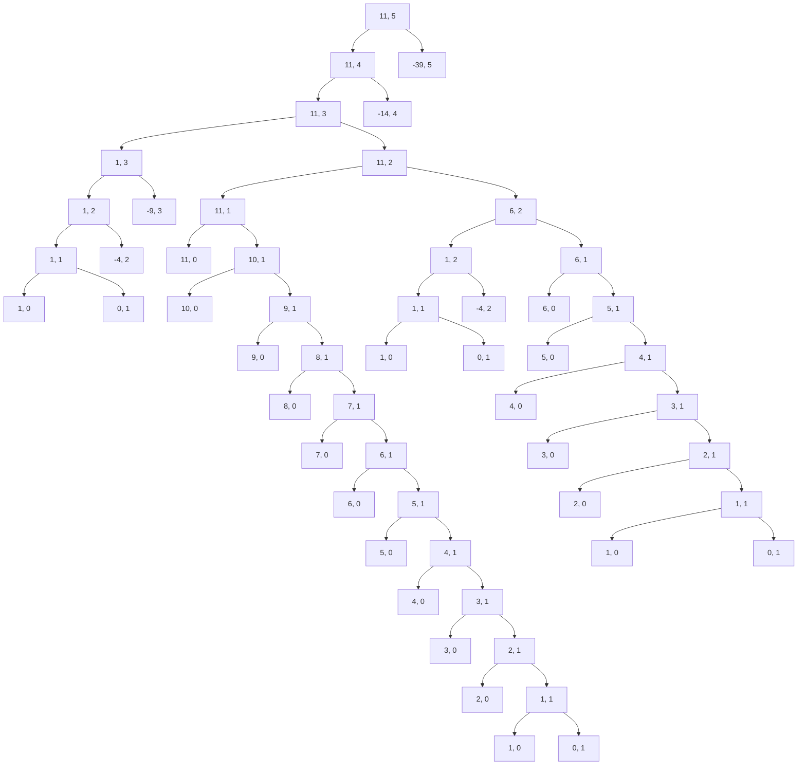

# Answer

### 1.

```mermaid
graph TD
    A[11, 5] --> B[11, 4]
    A --> C[-39, 5]
    B --> D[11, 3]
    B --> E[-14, 4]
    D --> F[11, 2]
    D --> G[1, 3]
    G --> H[1, 2]
    G --> I[-9, 3]
    H --> J[1, 1]
    H --> K[-4, 2]
    J --> L[1, 0]
    J --> M[0, 1]
    F --> N[11, 1]
    F --> O[6, 2]
    N --> P[11, 0]
    N --> Q[10, 1]
    Q --> R[10, 0]
    Q --> S[9, 1]
    S --> T[9, 0]
    S --> U[8, 1]
    U --> V[8, 0]
    U --> W[7, 1]
    W --> Z[7, 0]
    W --> Y[6, 1]
    Y --> X[6, 0]
    Y --> a[5, 1]
    a --> b[5, 0]
    a --> c[4, 1]
    c --> d[4, 0]
    c --> e[3, 1]
    e --> f[3, 0]
    e --> g[2, 1]
    g --> h[2, 0]
    g --> i[1, 1]
    i --> j[1, 0]
    i --> k[0, 1]
    O --> l[6, 1]
    O --> m[1, 2]
    m --> n[1, 1]
    m --> o[-4, 2]
    n --> p[1, 0]
    n --> q[0, 1]
    l --> r[6, 0]
    l --> s[5, 1]
    s --> t[5, 0]
    s --> u[4, 1]
    u --> v[4, 0]
    u --> w[3, 1]
    w --> x[3, 0]
    w --> y[2, 1]
    y --> z[2, 0]
    y --> Aa[1, 1]
    Aa --> Bb[1, 0]
    Aa --> Cc[0, 1]
```

```
Number of steps: theta of (amount^5)
==> This Answer is from https://sicp-solutions.net/post/sicp-solution-exercise-1-14/

Size of memory space: theta of (amount)
```